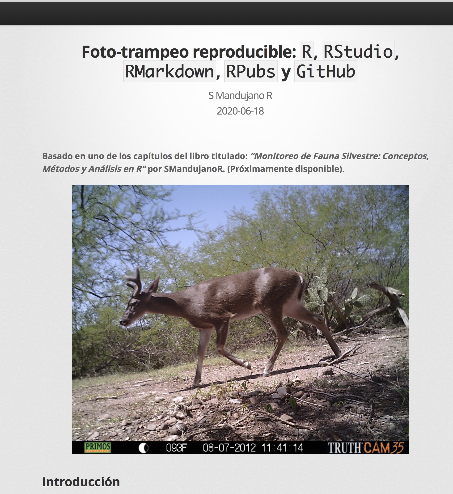
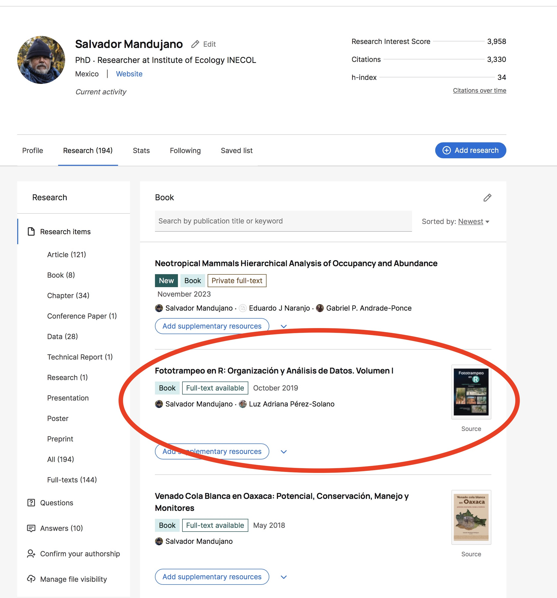

---

# Taller de FototrampeoR

---

- Versión Beta: **Paquete RAI_eR_Beta.R**
- Objetivo: **Calcular la abundancia relativa (RAI) y la tasa de encuentro (eR) con datos obtenidos con cámaras trampa**
- Elaborado por: **SMandujanoR**  <https://www.researchgate.net/profile/Salvador_Mandujano>
- Última modificación: **Octubre 30, 2023**

---

# Citar este paquete como:

Mandujano, S. 2019. Índice de abundancia relativa: RAI. Pp. 131-144, in: S. Mandujano & L. A. Pérez-Solano (eds.), Foto-trampeo en R: Organización y análisis de datos, Volumen I. Instituto de Ecología A. C., Xalapa, Ver., México. 243pp. ISBN: 978-607-7579-90-8.

---

# Previamente instalar los paquetes:

paquetes <- c("agricolae", "MASS", "maptools", "raster", "RColorBrewer", "stringr", "xtable", "akima", "prettymapr", "GISTools", "leaflet")

pkgs_miss <- paquetes[!(paquetes %in% 
                          installed.packages())]

if(length(pkgs_miss)>0L)
  install.packages(pkgs_miss, 
  repos = "https://cloud.r-project.org/", 
  dependencies = TRUE)

---

# Para clonar el paquete desde GitHub:

- Paso 1: entrar a la liga <https://github.com/SMandujanoR/RAI_eR_Beta>

- Paso 2: Ir a la pestaña verde de `Code`
  

- Paso 3: Bajar el `ZIP` o bien a través de `GitHub Desktop`
  

---

# Importante: 

El paquete automáticamente guardar las tablas de resultados, gráficos y mapas. Si prefiere primero visualizar se debe desactivar "guardar tablas y figuras" empleando el simbolo "#" en el script RAI_eR_Beta.R

---

# MATERIAL COMPLEMENTARIO PARA CONSULTAR Y FACILITAR EL EMPLEO DEL PAQUETE:

---

**1. Tutorial del empleo de R para datos de fototrampeo en: https://rpubs.com/SMR8810/FTR_reproducible**

---

**2. Página del libro "FototrampeoR: Organización y análisis de datos, Volumen 1" en: https://smandujanor.github.io/Foto-trampeo-R-Vol_I**

---

**3. PDF del libro en: https://www.researchgate.net/publication/348922971_Fototrampeo_en_R_Organizacion_y_Analisis_de_Datos_Volumen_I**

---

**4. Material (códigos R y datos) del libro: https://smandujanor.github.io/Foto-trampeo-R-Vol_I** 

---

**5. Si se empleo camtrapR para etiquetar, organizar y generar la data.frame, se sugiere consultar la siguiente viñeta para preparar la data.frame que requiere el paquete RAI_eR en: https://rpubs.com/SMR8810/IAR_datos** 

---

**6. Para más detalles de cómo usar la función para crear una grid de camáras consultar la viñeta en: https://rpubs.com/SMR8810/Grid_camaras**

---

